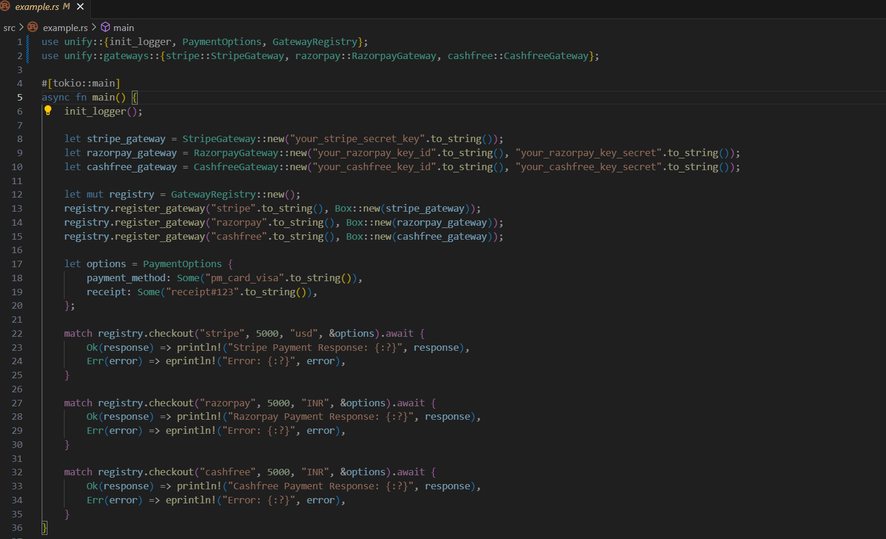

# Payment Gateway Integration

This Rust crate provides an abstraction layer for integrating multiple payment gateways, including Stripe, Razorpay, and Cashfree. It allows for easy switching between different payment providers through a common interface.

## Features

- **Stripe Integration**: Handle payments via Stripe API.
- **Razorpay Integration**: Handle payments via Razorpay API.
- **Cashfree Integration**: Handle payments via Cashfree API.
- **Flexible Options**: Configure payment options such as payment method and receipt.
- **Gateway Registry**: Manage and interact with different payment gateways using a unified registry.

<!-- ## Installation

Add this crate to your `Cargo.toml`:

```toml
[dependencies]
unify = { path = "path/to/your/crate" } -->


# .env file 

- STRIPE_SECRET_KEY=your_stripe_secret_key
- RAZORPAY_KEY_ID=your_razorpay_key_id
- RAZORPAY_KEY_SECRET=your_razorpay_key_secret
- CASHFREE_KEY_ID=your_cashfree_key_id
- CASHFREE_KEY_SECRET=your_cashfree_key_secret


